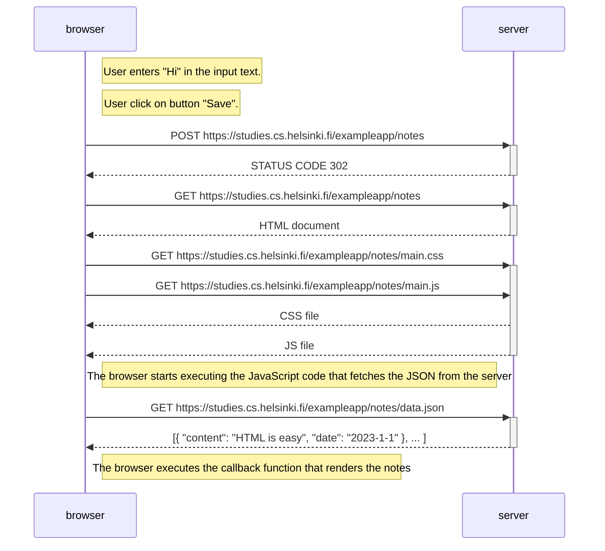

# 0.4 New note Diagram

```mermaid
sequenceDiagram
    participant browser
    participant server
    
    Note right of browser: User enters "Hi" in the input text.
    Note right of browser: User click on button "Save".

    browser->>+server: POST https://studies.cs.helsinki.fi/exampleapp/notes
    server-->>-browser: STATUS CODE 302 
    
    browser->>+server: GET https://studies.cs.helsinki.fi/exampleapp/notes
    server-->>-browser: HTML document
    
    browser->>+server: GET https://studies.cs.helsinki.fi/exampleapp/notes/main.css    
    browser->>server: GET https://studies.cs.helsinki.fi/exampleapp/notes/main.js
    server-->>browser: CSS file
    server-->>-browser: JS file
    
    Note right of browser: The browser starts executing the JavaScript code that fetches the JSON from the server
    
    browser->>+server: GET https://studies.cs.helsinki.fi/exampleapp/notes/data.json
    server-->>-browser: [{ "content": "HTML is easy", "date": "2023-1-1" }, ... ]
    
    Note right of browser: The browser executes the callback function that renders the notes

```

