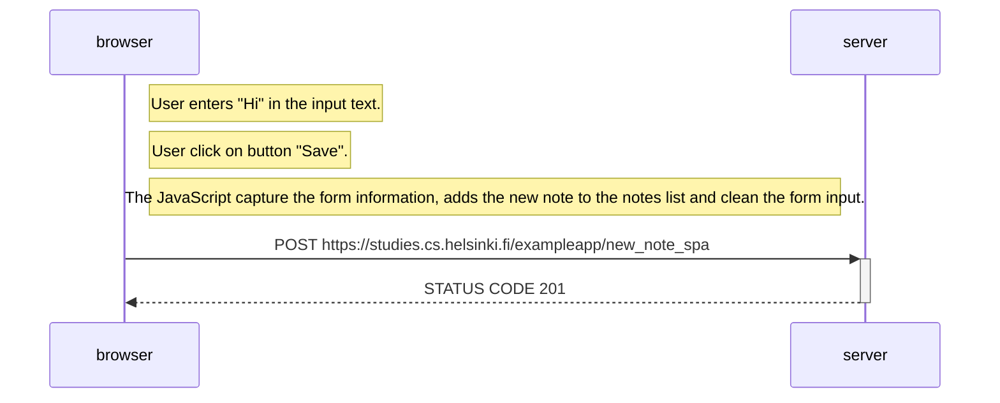

# 0.6 New note in SPA

```mermaid
sequenceDiagram
    participant browser
    participant server
    
    Note right of browser: User enters "Hi" in the input text.
    Note right of browser: User click on button "Save".
    
	Note right of browser: The JavaScript capture the form information, adds the new note to the notes list and clean the form input. 
	
    browser->>+server: POST https://studies.cs.helsinki.fi/exampleapp/new_note_spa
    server-->>-browser: STATUS CODE 201 
```
